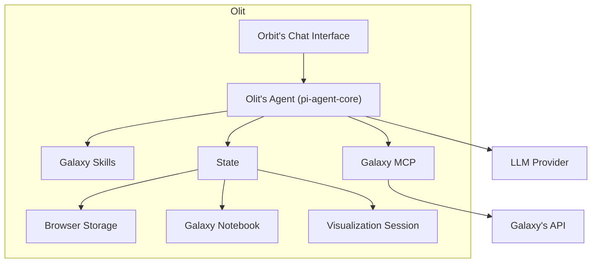

# Olit: A Browser-Native AI Co-Scientist for Galaxy

Olit is an AI co-scientist that runs directly inside Galaxy, in the web browser.

It can inspect histories and datasets, plan analyses, search for and run Galaxy tools and workflows, follow their execution, inspect results, perform local computation, create visualizations and other artifacts, and continue working from what it finds.

**The browser runs the agent; Galaxy runs the science.**

Galaxy provides the computational environment: datasets, tools, workflows, jobs, histories, and provenance. Lightweight Python runs locally through Pyodide. The agent uses the researcher's active Galaxy session, and model credentials remain in the browser.

No separate agent server or per-user compute container is required.

## Why Olit?

Galaxy already provides AI capabilities for tasks such as chat, error analysis, and tool recommendation. Olit explores a different question:

> **Can an open-ended AI co-scientist operate Galaxy directly from the browser, using Galaxy itself as its computational environment?**

A research question can become a multi-step Galaxy analysis. Olit can inspect the available data, develop a plan, select and configure tools, submit jobs and workflows, wait for their results, inspect the outputs, and continue the analysis based on what it finds.

Scientific computation remains in Galaxy. Tools, parameters, inputs, outputs, and provenance remain part of the normal Galaxy research record rather than moving into a separate agent environment.

## Architecture



## Olit and Orbit

[Orbit](https://github.com/galaxyproject/loom) is Galaxy's flagship AI environment and the main functional reference for Olit. Orbit pioneered the AI co-scientist model for Galaxy: an open-ended agent that can plan analyses, work with Galaxy tools and workflows, inspect results, and continue a research process over multiple steps.

Olit explores how that model translates to a browser-native architecture. Its name reflects that lineage, in a relationship similar in spirit to JupyterLab and JupyterLite: the research experience is adapted to a different runtime environment.

| | Orbit | Olit |
| --- | --- | --- |
| Agent runtime | Local/server (pi) | Browser worker (pi-agent-core) |
| Scientific computation | Local environment + Galaxy | Galaxy |
| Shell | Available | None |
| Filesystem | Local filesystem | Galaxy data + browser storage |
| Galaxy access | MCP | Active Galaxy session |
| Deployment | Agent environment | Galaxy visualization plugin |
| Per-user agent backend | Required | None |

The architectures have different capability envelopes. Orbit provides a shell, local processes, unrestricted networking, and a conventional filesystem. Olit investigates what an AI co-scientist can do when the browser provides the agent runtime and Galaxy provides the scientific computational environment.

## Galaxy as the computational environment

Olit's constraints are deliberate.

Scientific analyses execute as normal Galaxy jobs and workflows. Inputs and outputs remain Galaxy datasets and collections. Galaxy records the tools, parameters, inputs, outputs, and provenance of the analysis.

Pyodide complements that remote computation with local Python for lightweight exploration and intermediate computation. Browser storage provides local agent state, while persistent research outputs can be represented using Galaxy-native artifacts.

The result is a division of responsibilities:

- **Galaxy** provides scientific tools, workflows, data, jobs, provenance, and persistent research outputs.
- **Pyodide** provides lightweight local Python computation.
- **The browser** provides the agent runtime, interface, local state, networking, and model connection.

Olit therefore does not introduce another general-purpose computational environment alongside Galaxy.

## Inside Galaxy

Olit is built as an application on Galaxy's Charts visualization plugin framework.

Galaxy visualization plugins are not limited to plots and viewers: they can be complete browser applications with access to Galaxy data and services. Olit uses that existing extension point to deliver an AI co-scientist inside the Galaxy interface.

Because Olit is served by Galaxy, it is same-origin with the Galaxy API and can operate through the researcher's active session. In normal embedded operation, this avoids a local proxy, a separate agent process, or a long-lived Galaxy API key held by another service.

The agent runs in a Web Worker on pi-agent-core, the loop Orbit itself is built on. Python runs apart from it, in a worker of its own with an opaque origin, started when the agent first runs Python. The surrounding application connects the interface, browser runtime, model provider, and active Galaxy session. Model credentials remain in the browser rather than being held by a separate Olit backend.

This allows Olit to be distributed through Galaxy's existing visualization infrastructure without requiring a separate agent service.

`LAYOUT.md` maps the repository and its major components.

## Running it

Install dependencies once:

```bash
npm install
```

Then start the development environment:

```bash
npm run dev
```

The first run fetches the Pyodide assets and the skills corpus and can take a few minutes.

To serve what is already built:

```bash
npx vite
```

The eval harness drives the agent as a Node module, rebuilt from source:

```bash
npm run build:session
```

### Against the stub

The end-to-end stub requires neither Galaxy nor a model. See `e2e/README.md`.

```bash
node e2e/stub.cjs &
GALAXY_ROOT=http://127.0.0.1:8099 \
LLM_PROVIDER=ollama \
LLM_ROOT=http://127.0.0.1:8099 \
LLM_PATH=/v1 \
LLM_MODEL=stub-model \
LLM_CONTEXT_WINDOW=40000 \
npm run dev
```

### Against Galaxy and a model

```bash
GALAXY_ROOT=http://127.0.0.1:8080 \
GALAXY_KEY=<galaxy-api-key> \
LLM_PROVIDER=google \
LLM_KEY="$GEMINI_API_KEY" \
LLM_MODEL=gemini-3.7-flash \
npm run dev
```

`LLM_PROVIDER` names an entry in `src/agent/providers.ts`. A provider pi-ai defines (Gemini, DeepSeek, OpenRouter, OpenAI, Anthropic, Groq, Mistral, xAI) is pi's own: its endpoint, API, context windows and, headless, its key variable (`GEMINI_API_KEY`, `OPENROUTER_API_KEY`, ...). Olit defines only the Galaxy proxy, Jetstream2 and local servers. Set `LLM_ROOT` and `LLM_PATH` for an endpoint neither registry contains.

`GALAXY_KEY` is needed during local development because Vite serves Olit outside Galaxy, where the Galaxy session cookie does not apply.

Leave `LLM_PROVIDER` unset to use the provider picker. This is the production path: the model key remains in the browser worker.

## Temporary galaxy-ops artifact

Olit depends on galaxy-ops changes that are in review upstream and not yet in an npm release.
Until they are, `package.json` pins an immutable candidate build attached to a pre-release on
the `guerler/galaxy-mcp` fork. Nothing here is published to npm or to `galaxyproject/galaxy-mcp`.

| | |
| --- | --- |
| package | `@galaxyproject/galaxy-ops` `0.3.2-ops.0` |
| asset | https://github.com/guerler/galaxy-mcp/releases/download/ops-v0.3.2-ops.0/galaxyproject-galaxy-ops-0.3.2-ops.0.tgz |
| release | `ops-v0.3.2-ops.0` (pre-release on `guerler/galaxy-mcp`) |
| built from | branch `ops-artifact.000` @ `ca7b84762ca3cbd8c42de9bfa1306412829b8080`: the PR branch `ops.000` @ `594ba16b54acf7f941e21619889ad7685307a88b` plus one version-bump commit |
| upstream base | `galaxyproject/galaxy-mcp` `main` @ `72503b3` |
| sha256 | `6a5743c365ef9a920523d38f6e0a718b982e0dff61a85bb5f9479bc3347bc8a1` |
| npm integrity | `sha512-c/E5wjjIFf8YyehA5sn5RxcMlYyEon7SmKa7N677lZngU2GfogJNB2y1T/9FkWBCo/K8YHk/rpqQkiFrXPghZA==` (recorded in `package-lock.json`) |

It carries these `ops.000` commits on top of the upstream base:

```
451c069 Type an operation's input as what a caller hands it
3c8fae3 Declare what an operation's result is, and read it back
e265c20 Compare the result shape the two surfaces state, and declare where it differs
a0a782d Answer get_page with Galaxy's hash of the editable source, on both surfaces
830d306 Let an operation say when it destroys, what it polls, and what stays put for a session
738a2cc Let update_page replace one section and refuse a stale write, on both surfaces
61e130f Read get_job_details in full and keep both ends of its logs, on both surfaces
a6035e1 Let get_invocations say what a run amounted to from its jobs, on both surfaces
b226b19 Let Galaxy page get_history_contents with its real total, a fixed order, the output budget and no dataset_id, on both surfaces
0088629 Declare the result fields get_history_details, get_collection_details and get_workflow_input_template already answer with
3d6ba55 Settle a job wait on skipped and stopped too, from the one settled-state list the invocation roll-up uses
594ba16 Export the dataset and invocation terminal states from the browser entry
```

`npm ci` fetches the asset and checks it against the lockfile's integrity, so a clean checkout and
CI install the same bytes and need no local galaxy-ops checkout. `npm run stale` reports the pin as
temporary.

The asset is immutable. If the candidate has to change, it becomes branch `ops-artifact.001` and
release `ops-v0.3.2-ops.1`, never a replaced `.0`.

**Replacing it** once an npm release of `@galaxyproject/galaxy-ops` contains the commits above:

```bash
npm install @galaxyproject/galaxy-ops@<that version>   # rewrites package.json and the lockfile
npm test
```

then delete this section. It is a dependency-only change.

## Tests

```bash
npm test
```

This runs Vitest, script linting, TypeScript type checking, vendored-file verification, and the end-to-end drives.

To inspect the surface exposed to the agent:

```bash
npm run build:session && node dist/session.mjs --describe --root .
```

This reports the tools and parameters exposed to the agent, the Galaxy queries they construct, guards that can refuse calls, and the sampling and loop policies.

## Scope

Olit deliberately does not reproduce a general-purpose local computing environment.

`run_python` executes inside Pyodide. Submitted code is asynchronous, so top-level `await` and `pyfetch` work, but networking follows browser security rules: CORS-enabled APIs are accessible; arbitrary network resources are not.

Python is isolated from the agent rather than restricted. It keeps that network access and loses only authority: its worker has an opaque origin, so it holds no Galaxy session, no storage of the page, and no reach into the agent's state or model credentials, and its requests go without credentials. Galaxy is reached through the agent's Galaxy tools, where the destructive-operation gate applies. Stop ends a running Python call along with its state. Headless, the same realm is a Node child process with an empty environment that may read only Pyodide's files.

For research requiring a shell, unrestricted networking, local software installation, or a full filesystem, Orbit provides the appropriate execution environment.

Olit instead tests a different architectural proposition:

> **Galaxy is the computational environment. The browser is the agent runtime.**
