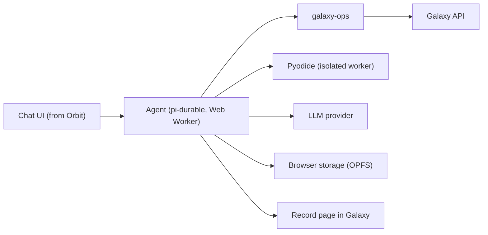

# Olit: an AI co-scientist inside Galaxy

Olit runs in the browser, inside Galaxy. It inspects histories and datasets, plans analyses, finds
and runs Galaxy tools and workflows, follows their jobs, reads the results, and keeps a record of
the analysis as a Galaxy page.

**The browser runs the agent; Galaxy runs the science.** Analyses are ordinary Galaxy jobs and
workflows with their usual provenance. Light Python runs in the browser through Pyodide. There is
no agent server and no per-user container: Olit uses your Galaxy session, and your model key stays
in your browser.

## Try it in Galaxy

**Requirements:** Galaxy 26.1 or newer; a model provider key (or a Galaxy whose admin configured
its chat proxy); a current Chrome or Firefox (Safari is untested).

1. Add Olit to your Galaxy's `client/visualizations.yml`, with the version on npm:

   ```yaml
   olit:
       package: "@galaxyproject/olit"
       version: <version>
   ```

2. Rebuild the client (`make client`, or `cd client && pnpm run plugins`) and restart Galaxy.
3. Select a csv, tabular or txt dataset, choose **Visualize**, and open **AI Research
   Assistant**. Olit works in that dataset's history.
4. Pick a provider and paste its key: Gemini, DeepSeek, OpenRouter, OpenAI, Anthropic, Groq,
   Mistral, xAI, Jetstream2, a local OpenAI-compatible server, or Galaxy's chat proxy. The key is
   kept for this tab only and sent nowhere but to the provider.

Olit keeps its conversation in the browser's private file system, so a reload continues where you
left off; a private window keeps it in memory and says so. **Save** stores the conversation in
Galaxy as a visualization you can reopen anywhere, and the analysis record is a page attached to
the history.

## Architecture



- The agent runs on [pi-durable](https://github.com/earendil-works/pi): conversations, runs and
  submitted Galaxy work are committed to SQLite in the browser, so they survive a reload.
- Galaxy operations come from `@galaxyproject/galaxy-ops`, the same operations galaxy-mcp serves,
  described to the model as galaxy-mcp describes them.
- Python runs in its own worker with an opaque origin: it has no Galaxy session, no page storage
  and no model key.

`LAYOUT.md` maps the source tree.

## Olit and Orbit

[Orbit](https://github.com/galaxyproject/loom) is Galaxy's AI environment and Olit's functional
reference; Olit reuses Orbit's chat interface.

| | Orbit | Olit |
| --- | --- | --- |
| Agent runtime | Local or server (pi) | Browser worker (pi-durable) |
| Computation | Local environment and Galaxy | Galaxy, plus Pyodide |
| Shell | Yes | No |
| Galaxy access | MCP | Your Galaxy session |
| Delivered as | Desktop app or web service | Galaxy visualization plugin |

For a shell, local software or unrestricted networking, use Orbit.

## Scope

`run_python` runs in Pyodide. Top-level `await` and `pyfetch` work; network access follows browser
rules, so CORS-enabled APIs are reachable and other sites are not. Galaxy is reached only through
Olit's Galaxy tools, where destructive operations ask before they run. Stop ends a running Python
call.

## Development

```bash
npm install
npm run dev        # builds (fetching Pyodide and the skills corpus on first run), then serves
npm test           # unit tests, linting, type checks, vendored-file checks, browser tests
npm run stale      # where the pinned upstreams stand
```

`npm run dev` against a local Galaxy and a model:

```bash
GALAXY_ROOT=http://127.0.0.1:8080 GALAXY_KEY=<galaxy-api-key> \
LLM_PROVIDER=google LLM_KEY="$GEMINI_API_KEY" LLM_MODEL=gemini-3.7-flash \
npm run dev
```

`GALAXY_KEY` is needed only because the dev server runs outside Galaxy. Leave `LLM_PROVIDER` unset
to get the provider picker, as in production. Providers are listed in `src/agent/providers.ts`.

The browser tests run against a stub Galaxy and model (`e2e/README.md`). The eval harness drives
a Node build of the agent: `npm run build:session`, and `node dist/session.mjs --describe --root .`
prints the tools, guards and policies the agent is given.
